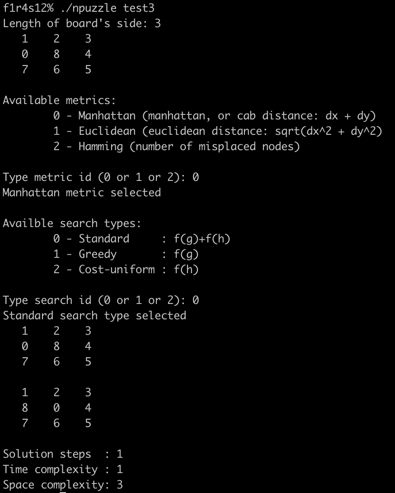

# n-puzzle

An Algo Project at Codam (42) - Sliding puzzle with A* algorithm

Solve sliding puzzle of an arbitrary size using A* algorithm. This project supports sizes 3x3 to 16x16, however execution time for puzzles bigger than 5x5 may raise dramatically.

[SUBJECT](/NPUZZLE_SUBJECT.pdf)
[REQUIREMENTS](https://github.com/k-off/n-puzzle/wiki)

### Implemented metrics:
 - Manhattan distance: `dx + dy`
 - Euclidean distance: `sqrt(dx^2 + dy^2)`
 - Hamming : `number of misplaced nodes`
 
### Additionaly imlemented:
 - Greedy search `tries local best solution first`
 - Uniform cost search `tries cheapest solution first`

## Usage:
```
make re
./npuzzle [file]
```
File is an optional argument. If it is not provided, npuzzle generates a random map of user-defined size. An input generator, `res-npuzzle-gen.py`, is included in this repository. 

### Valid file format:
```
# Some optional comment
3 #length of puzzle side
1 3 2
4 6 8
7 5 0
```

### Solution

Npuzzle prints all the board states (and their total amount) it went through to get from initial state to the solution, as well as complexity in time (number of iterations) and complexity in space (peak amount of states under consideration).
Below is the valid, `snail solution`, for 4x4 board:
```
01 02 03 04
14 15 16 05
13 00 17 06
12 19 18 07
11 10 09 08
```


